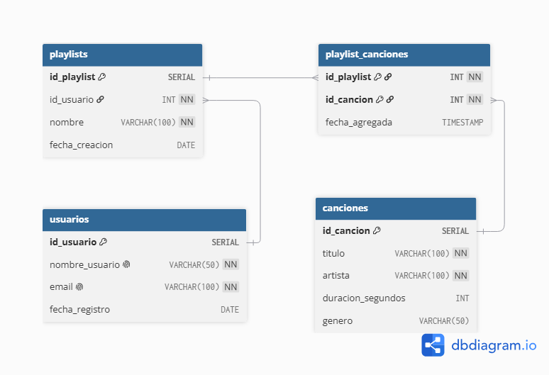

Para replicar el comportamiento básico de una aplicación estilo Spotify, necesitamos establecer relaciones entre los usuarios, las canciones y las playlists. Dado que una playlist puede tener muchas canciones y una canción puede estar en muchas playlists, se requiere una tabla intermedia.

**Entidades y Relaciones:**

* **Usuarios:** Almacena la información de las cuentas. Relación 1 a N con Playlists.
* **Canciones:** Almacena el catálogo musical. Relación N a M con Playlists.
* **Playlists:** Almacena las listas creadas por los usuarios. Relación N a 1 con Usuarios.
* **Playlist_Canciones (Tabla Intermedia):** Resuelve la relación N a M entre Playlists y Canciones.




#### 2. Construir el DDL (Data Definition Language)

El siguiente script define la estructura de las tablas, aplicando Claves Primarias (PK), Claves Foráneas (FK) con reglas de eliminación en cascada, y restricciones lógicas como `UNIQUE` y `CHECK`.

```sql
-- Creación de tabla Usuarios
CREATE TABLE usuarios (
    id_usuario SERIAL PRIMARY KEY,
    nombre_usuario VARCHAR(50) NOT NULL UNIQUE,
    email VARCHAR(100) NOT NULL UNIQUE,
    fecha_registro DATE DEFAULT CURRENT_DATE
);

-- Creación de tabla Canciones
CREATE TABLE canciones (
    id_cancion SERIAL PRIMARY KEY,
    titulo VARCHAR(100) NOT NULL,
    artista VARCHAR(100) NOT NULL,
    duracion_segundos INT CHECK (duracion_segundos > 0),
    genero VARCHAR(50)
);

-- Creación de tabla Playlists
CREATE TABLE playlists (
    id_playlist SERIAL PRIMARY KEY,
    id_usuario INT NOT NULL,
    nombre VARCHAR(100) NOT NULL,
    fecha_creacion DATE DEFAULT CURRENT_DATE,
    FOREIGN KEY (id_usuario) REFERENCES usuarios(id_usuario) ON DELETE CASCADE
);

-- Creación de tabla intermedia para la relación Muchos a Muchos
CREATE TABLE playlist_canciones (
    id_playlist INT NOT NULL,
    id_cancion INT NOT NULL,
    fecha_agregada TIMESTAMP DEFAULT CURRENT_TIMESTAMP,
    PRIMARY KEY (id_playlist, id_cancion),
    FOREIGN KEY (id_playlist) REFERENCES playlists(id_playlist) ON DELETE CASCADE,
    FOREIGN KEY (id_cancion) REFERENCES canciones(id_cancion) ON DELETE CASCADE
);

```

#### 3. Poblar la base de datos (DML)

A continuación, se presentan las sentencias `INSERT` para poblar las tablas respetando la integridad referencial (el orden de inserción es clave para no violar las Claves Foráneas).

```sql
-- Inserción de Usuarios
INSERT INTO usuarios (nombre_usuario, email) VALUES
('usuario_rockero', 'rock@ejemplo.com'),
('lofi_student', 'lofi@ejemplo.com'),
('dj_admin', 'dj@ejemplo.com');

-- Inserción de Canciones
INSERT INTO canciones (titulo, artista, duracion_segundos, genero) VALUES
('Bohemian Rhapsody', 'Queen', 354, 'Rock'),
('Stairway to Heaven', 'Led Zeppelin', 482, 'Rock'),
('Midnight City', 'M83', 243, 'Indie Pop'),
('Weightless', 'Marconi Union', 491, 'Ambient'),
('Around the World', 'Daft Punk', 429, 'Electronic');

-- Inserción de Playlists
INSERT INTO playlists (id_usuario, nombre) VALUES
(1, 'Clasicos del Rock'),
(2, 'Estudio y Concentracion'),
(3, 'Fiesta Electronica');

-- Asociación de Canciones a Playlists
INSERT INTO playlist_canciones (id_playlist, id_cancion) VALUES
(1, 1), -- Bohemian Rhapsody en Clasicos del Rock
(1, 2), -- Stairway to Heaven en Clasicos del Rock
(2, 4), -- Weightless en Estudio y Concentracion
(3, 3), -- Midnight City en Fiesta Electronica
(3, 5); -- Around the World en Fiesta Electronica

```

#### 4. Opcional: Carga de datos mediante COPY

La instrucción `COPY` es la forma más eficiente en PostgreSQL de cargar grandes volúmenes de datos reales (por ejemplo, exportaciones analíticas o datasets públicos). A continuación se muestra cómo los alumnos deberían estructurar el comando suponiendo que tienen un archivo CSV.

**Archivo de ejemplo imaginario (`canciones.csv`):**

```text
titulo,artista,duracion_segundos,genero
"Smells Like Teen Spirit","Nirvana",301,"Grunge"
"Billie Jean","Michael Jackson",294,"Pop"

```

**Script SQL para ejecutar la importación:**

```sql
-- El comando COPY requiere la ruta absoluta del archivo en el servidor 
-- o usar el comando \copy si se está ejecutando desde el cliente psql.

COPY canciones(titulo, artista, duracion_segundos, genero)
FROM '/ruta/absoluta/al/archivo/canciones.csv'
DELIMITER ','
CSV HEADER;

```
